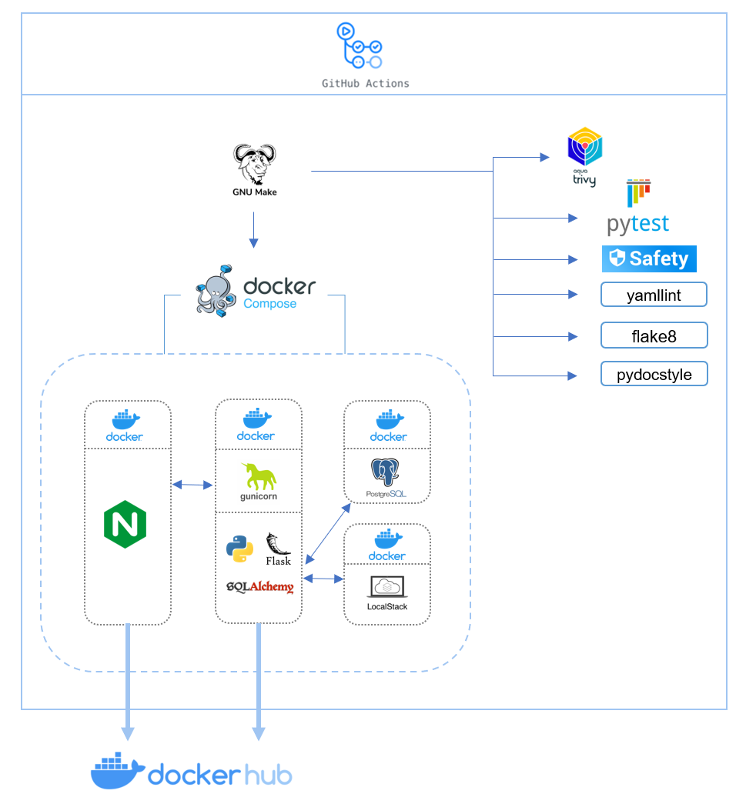
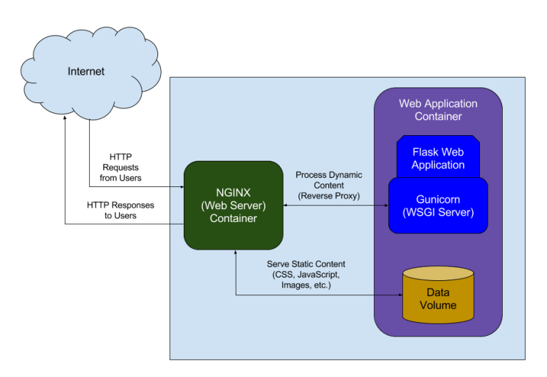

# financial-data-api &middot; 

- [1 - Architecture](#1---architecture)
  - [A - App CICD architecture](#a---app-cicd-architecture)
- [2 - Prerequisites](#2---prerequisites)
- [3 - Quickstart](#3---quickstart)
  - [A - Run local stack](#a---run-local-stack)
- [4 - Project file structure](#4---project-file-structure)
- [5 - CICD](#5---cicd)
  - [A - App CICD workflow](#a---app-cicd-workflow)
  - [B - Running the CICD pipeline locally](#b---running-the-cicd-pipeline-locally)
- [6 - Docker image build pattern](#6---docker-image-build-pattern)
  - [A - SemVer2](#a---semver2)
  - [B - Version bump](#b---version-bump)
- [7 - Testing framework](#7---testing-framework)
  - [A - GIVEN-WHEN-THEN (Martin Fowler)](#a---given-when-then-martin-fowler)
  - [B - Four-Phase Test (Gerard Meszaros)](#b---four-phase-test-gerard-meszaros)
  - [C - Debugging the code with VS Code remote-container extension](#c---debugging-the-code-with-vs-code-remote-container-extension)
- [8 - Gunicorn application server and Nginx reverse proxy](#8---gunicorn-application-server-and-nginx-reverse-proxy)

This repo is a demo project for dockerized flask applications (REST API). This simplified API exposes GET endpoints that allow you to pull stock prices and trading indicators. What is covered in this repo:

**Application code:**

- Github Actions CICD:
  - Static analysis: flake8, pydocstyle
  - Image misconfiguration/vulnerabilities (Trivy), passing artifacts between jobs
  - Testing patterns with Pytests (unit / integration)
  - Docker image build and distribution pattern
- Docker PostgreSQL DB setup for local testing
- Services configuration with Docker Compose
- Makefile template
- Flask blueprints
- Flask-SQLAlchemy implementation
- Nginx (reverse proxy) and Gunicorn (WSGI) implementation
- Dependency injection

## 1 - Architecture

### A - App CICD architecture



## 2 - Prerequisites

- [Docker](https://docs.docker.com/get-docker/)
- [Docker Compose CLI plugin](https://docs.docker.com/compose/install/compose-plugin/)
- If running on windows: [Docker remote containers on WSL 2](https://docs.microsoft.com/en-us/windows/wsl/tutorials/wsl-containers)

> The API doesn't require python installed on your machine.

## 3 - Quickstart

### A - Run local stack

Run the following commands to:

- Build the Docker image
- Run the app and db services locally
- Populate the db credentials secret in AWS Secrets Manager (localstack)
- Populate DB with TSLA and AMZN stock prices

```bash
cd app & make build-app build-nginx up
```

Verify the API is running:

```bash
curl -I http://localhost/_healthcheck
```

Get resampled data

```bash
$ curl -G -d 'interval=1' -d 'frequency=Annual' http://localhost/stocks/time-series/AMZN
[
  {
    "close": 92.392,
    "high": 101.79,
    "low": 84.253,
    "open": 95.455,
    "period_start": "2019-01-01",
    "symbol": "AMZN",
    "volume": 8154332000
  },
  {
    "close": 162.8465,
    "high": 177.6125,
    "low": 81.3015,
    "open": 93.75,
    "period_start": "2020-01-01",
    "symbol": "AMZN",
    "volume": 24950814000
  },
  {
    "close": 166.717,
    "high": 188.654,
    "low": 144.05,
    "open": 163.5,
    "period_start": "2021-01-01",
    "symbol": "AMZN",
    "volume": 17076362000
  },
  {
    "close": 116.46,
    "high": 171.4,
    "low": 101.26,
    "open": 167.55,
    "period_start": "2022-01-01",
    "symbol": "AMZN",
    "volume": 10032250600
  }
]
```

## 4 - Project file structure

```text
.
├── .github
│   ├── workflow
│   │   └── app_code_cicd.yml
├── app
├── docs
├── .gitignore
├── Makefile
├── README.md
```

In [./app](./app)

```text
.
├── config
│   ├── .yamllint
│   └── api_settings
│       ├── development
│       │   └── config.yaml
│       ├── local
│       │   └── config.yaml
│       ├── production
│       │   └── config.yaml
│       ├── test
│       │    └── config.yaml
│       └── gunicorn.py
├── docker
│   ├── app
│   │   └── Dockerfile
│   ├── nginx
│   │   ├── Dockerfile
│   │   └── nginx.conf
│   └── docker-compose.yaml
├── src
│   ├── __init__.py
│   ├── app.py
│   ├── blueprints
│   │   ├── healthcheck.py
│   │   └── stocks.py
│   └── models.py
├── tests
│   ├── __init__.py
│   ├── conftest.py
│   ├── integration
│   │   ├── test_data
│   │   │   └── stocks_ohlcv.csv
│   │   ├── __init__.py
│   │   ├── test_app.py
│   │   └── test_stocks.py
│   └── unit
│       ├── __init__.py
│       └── test_helpers.py
├── .dockerignore
├── Makefile
├── requirements.in
├── requirements.txt
```

## 5 - CICD

### A - App CICD workflow


<br></br>

- **yamllint:** Lints yaml files in the repo
- **flake8:** Lints .py files in the repo
- **pydocstyle:** Checks compliance with Python docstring conventions
- **safety:** python packages vulnerabilities scanner
- **image-misconfiguration:** Detect configuration issues in Dockerfile(Trivy)
- **build:** Build Docker image and push it to the pipeline artifacts
- **image-vulnerabilities:** Image vulnerablities scanner(Trivy)
- **unit-tests:** Test the smallest piece of code(functions) that can be isolated
- **integration-tests:** Series of tests which call the API
- **push-app-image-to-registry:** Push the application server Docker image to [Docker Hub](https://hub.docker.com/r/tambona29/financial-data-api)
- **push-nginx-image-to-registry:** Push the custom Nginx Docker image to [Docker Hub](https://hub.docker.com/repository/docker/tambona29/nginx-demo)

> Note that the last job should be skipped when running the pipeline locally.
This is ensured using `if: ${{ !env.ACT }}` in the `push-to-registry` job.
Running this locally means there will be a conflicting image tag when the Github Actions CICD will try and run it a second time.

### B - Running the CICD pipeline locally

Install [act](https://github.com/nektos/act) to run the jobs on your local machine.

Example:

```bash
make app-cicd  # Run the full app CICD pipeline without pushing to Docker Hub
```

These commands require `secrets.txt` with this content:

```bash
GITHUB_TOKEN=<YOUR_PAT_TOKEN>
DOCKERHUB_USERNAME=<YOUR_DOCKERHUB_USERNAME>
DOCKERHUB_TOKEN=<YOUR_DOCKERHUB_TOKEN>
```

Optionally you could also run pipeline jobs using the [Makefile](./app/Makefile) directly.

Example:

```bash
make pydocstyle
make tests
```

Some jobs such as `image-vulnerabilities` can be run in isolation using the act `-j <job-name>` command (example `-j image-vulnerabilities`).

## 6 - Docker image build pattern

The requirements are:

- A dev image should be pushed to [Docker Hub](https://hub.docker.com/r/tambona29/financial-data-api/tags) everytime a `git push` is made. That allows end-to-end testing in dev environment. I chose Docker Hub over AWS as Docker Hub is still the best choice for distributing software publicly.

- Leverage pipeline artifacts to avoid rebuilding the image from scratch across jobs. Also pass image tag variables between jobs/steps using the output functionality to keep the code DRY.

- The image tag should follow [SemVer specifications](https://semver.org/) which is `MAJOR.MINOR.PATCH-<BRANCH NAME>.dev.<COMMIT SHA>` for dev versions and `MAJOR.MINOR.PATCH` for production use.

### A - SemVer2

|   Branch  | Commit # | Image Version | Image Tag  |
|:---------:|:--------:|:-------------:|:----------:|
| feature-1 |     1    |      1.0.0    | 1.0.0-feature-1.dev.b1d7ba7fa0c6a14041caaaf4025f6cebb924cb0f |
| feature-1 |     2    |      1.0.0    |   1.0.0-feature-1.dev.256e60e615e89332c5f602939463500c1be5d90a |
|   main    |     5     |      1.0.0    |    1.0.0 |

> The [docker/metadata-action@v4](https://github.com/docker/metadata-action#semver) task can automate this but it requires using git tags which can be a bit cumbersome as it requires an update for each commit. So I preferred reimplementing something straightforward that uses the git branch name and commit SHA to form the image tag.

### B - Version bump

Each PR should contain a new version of the `IMAGE_VERSION` in [.github/workflows/app_code_cicd.yml](.github/workflows/app_code_cicd.yml#L6)

## 7 - Testing framework

### A - [GIVEN-WHEN-THEN](https://martinfowler.com/bliki/GivenWhenThen.html) (Martin Fowler)

**GIVEN** - Describes the state of the world before you begin the behavior you're specifying in this scenario. You can think of it as the pre-conditions to the test.

**WHEN** - Behavior that you're specifying.

**THEN** - Changes you expect due to the specified behavior.

### B - [Four-Phase Test](http://xunitpatterns.com/Four%20Phase%20Test.html) (Gerard Meszaros)


*(image from [Four-Phase Test](http://xunitpatterns.com/Four%20Phase%20Test.html))*
<br></br>

For integration testing, the *Setup* phase consists in truncating and repopulating the `market_data` DB (cf [db_fixture](app/tests/conftest.py#L52))

### C - Debugging the code with VS Code remote-container extension

For debugging the code from within a Docker container you can use VS Code with the following config:

in `.devcontainer/devcontainer.json`

```json
{
  "name": "Existing Dockerfile",
  "context": "../app",
  "dockerFile": "../app/docker/app/Dockerfile",

  "runArgs": [ "--network=host"],

  "remoteUser": "root",
  "remoteEnv": {
    "ENVIRONMENT": "test",
    "AWS_ACCESS_KEY_ID": "test",
    "AWS_SECRET_ACCESS_KEY": "test",
    "AWS_DEFAULT_REGION": "us-east-1"
  },
  "customizations": {
    "vscode": {
      "extensions": [
        "ms-python.python"
      ]
    }
  }
}

```

in `.vscode/launch.json`

```text
{
    "version": "0.2.0",
    "configurations": [
        {
            // Testing extensions are very unstable in the remote-container extension
            // Hence it's preferable to run the tests from launch.json
            "name": "test_time_series",
            "type": "python",
            "request": "launch",
            "module": "pytest",
            "args": ["tests/integration/test_stocks.py::test_time_series"],
            "cwd": "${workspaceFolder}/app",
            "justMyCode": false, // Debug only user-written code
        }
    ]
}
```

In addition to this I have also written another [documentation](https://github.com/teddy-ambona/developer-workstation#debugging-inside-a-docker-container) for remote-container extension that can be quite handy.

## 8 - Gunicorn application server and Nginx reverse proxy

From the [Flask documentation](https://flask.palletsprojects.com/en/1.1.x/deploying/):

> "While lightweight and easy to use, Flask’s built-in server is not suitable for production as it doesn’t scale well."

Hence we need a more robust web-server than the flask web server, and the answer is: [Gunicorn](https://gunicorn.org/) and [Nginx](https://www.nginx.com/resources/glossary/nginx/). Gunicorn is a Python WSGI HTTP Server for UNIX. It's a pre-fork worker model. The Gunicorn server is broadly compatible with various web frameworks, simply implemented, light on server resources, and fairly speedy.

With Gunicorn as a web server our app is now more robust and scalable, however we need a way to balance the load to the Gunicorn workers, that's when Nginx is quite useful. Nginx is also a web server but more commonly used as a reverse proxy. **Thereforce Gunicorn acts as an application server whilst Nginx behaves as a reverse proxy**

The terminology is well defined in [this article](https://realpython.com/django-nginx-gunicorn/#replacing-wsgiserver-with-gunicorn):

>- **Flask is a web framework.** It lets you build the core web application that powers the actual content on the site. It handles HTML rendering, authentication, administration, and backend logic.
>
>- **Gunicorn is an application server.** It translates HTTP requests into something Python can understand. Gunicorn implements the Web Server Gateway Interface (WSGI), which is a standard interface between web server software and web applications.
>
>- **Nginx is a web server.** It’s the public handler, more formally called the reverse proxy, for incoming requests and scales to thousands of simultaneous connections.

If you still struggle to understand what Nginx can achieve, check out this [repo from AWS Labs](https://github.com/awslabs/ecs-nginx-reverse-proxy/tree/master/reverse-proxy).

Here’s a diagram illustrating how Nginx fits into a Flask web application:



*(image from [How to Configure NGINX for a Flask Web Application](https://www.patricksoftwareblog.com/how-to-configure-nginx-for-a-flask-web-application/))*
<br></br>
