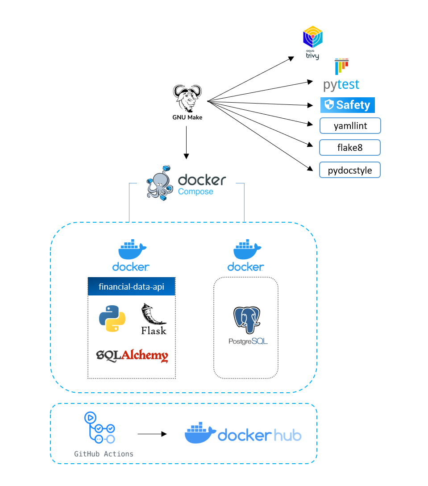
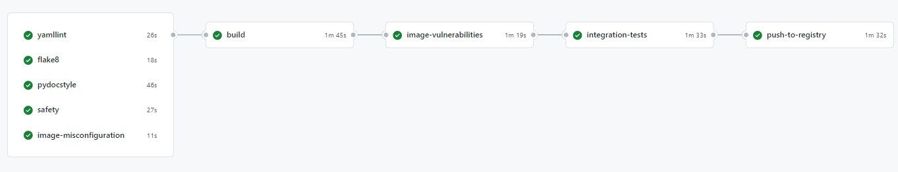
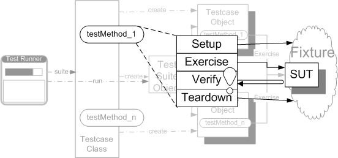

# financial-data-api &middot; 

- [1 - Prerequisites](#1---prerequisites)
- [2 - Quickstart](#2---quickstart)
- [3 - Project file structure](#3---project-file-structure)
- [4 - CICD](#4---cicd)
  - [A - App CICD overview](#a---app-cicd-overview)
  - [B - Infra CICD overview](#b---infra-cicd-overview)
  - [C - Running the CICD pipeline locally](#c---running-the-cicd-pipeline-locally)
- [5 - Docker image build pattern](#5---docker-image-build-pattern)
  - [A - SemVer2](#a---semver2)
  - [B - Version bump](#b---version-bump)
- [6 - Testing framework](#6---testing-framework)
  - [A - GIVEN-WHEN-THEN (Martin Fowler)](#a---given-when-then-martin-fowler)
  - [B - Four-Phase Test (Gerard Meszaros)](#b---four-phase-test-gerard-meszaros)
- [7 - Deployment to AWS with Terraform](#7---deployment-to-aws-with-terraform)
  - [A - Keep your code DRY with Terragrunt](#a---keep-your-code-dry-with-terragrunt)
  - [B - Best practices](#b---best-practices)
  - [C -](#c--)

This repo is a demo project for dockerized flask applications(REST API). This simplified API exposes GET endpoints that allow you to pull stock prices and trading indicators. You will find the following implementation:

- Terraform (Iaac) deployment on AWS
- How to keep your terraform code DRY with Terragrunt
- Github Actions CICD
- Docker image build and distribution pattern
- Docker PostgreSQL DB setup for local testing
- Services configuration with Docker Compose
- Makefile template
- Testing patterns(unit & integration with Pytest)
- Flask-SQLAlchemy with blueprints implementation
- Dependency injection

## 1 - Prerequisites

- [Docker](https://docs.docker.com/get-docker/)
- [Docker Compose CLI plugin](https://docs.docker.com/compose/install/compose-plugin/)
- If running on windows: [Docker remote containers on WSL 2](https://docs.microsoft.com/en-us/windows/wsl/tutorials/wsl-containers)
- [AWS CLI](https://docs.aws.amazon.com/cli/latest/userguide/getting-started-install.html)
- [Terraform CLI](https://www.terraform.io/cli/install/apt)
- [Terragrunt](https://terragrunt.gruntwork.io/docs/getting-started/install/)
- [(Optional) Jq](https://stedolan.github.io/jq/download/)

> The API doesn't require python installed on your machine.

## 2 - Quickstart

Run the following commands to:

- Build the Docker image
- Run the app and db services
- Populate DB with TSLA and AMZN stock prices

```bash
make build up
```

Verify the API is running:

```bash
curl -I http://127.0.0.1:5000/_healthcheck
```

Get resampled data

```bash
$ curl -G -d 'interval=1' -d 'frequency=Annual' http://127.0.0.1:5000/stocks/time-series/AMZN
[
  {
    "close": 92.392,
    "high": 101.79,
    "low": 84.253,
    "open": 95.455,
    "period_start": "2019-01-01",
    "symbol": "AMZN",
    "volume": 8154332000
  },
  {
    "close": 162.8465,
    "high": 177.6125,
    "low": 81.3015,
    "open": 93.75,
    "period_start": "2020-01-01",
    "symbol": "AMZN",
    "volume": 24950814000
  },
  {
    "close": 166.717,
    "high": 188.654,
    "low": 144.05,
    "open": 163.5,
    "period_start": "2021-01-01",
    "symbol": "AMZN",
    "volume": 17076362000
  },
  {
    "close": 116.46,
    "high": 171.4,
    "low": 101.26,
    "open": 167.55,
    "period_start": "2022-01-01",
    "symbol": "AMZN",
    "volume": 10032250600
  }
]
```

## 3 - Project file structure

```text
.
├── .github
│   ├── workflow
│   │   │── app_code_cicd.yml
│   │   └── infra_code_cicd.yml
├── app
├── docs
├── terraform
├── .gitignore
├── Makefile
├── README.md
```

In `./app`

```text
.
├── config
│   ├── .yamllint
│   └── api_settings
│       ├── development
│       │   └── config.yaml
│       ├── local
│       │   └── config.yaml
│       ├── production
│       │   └── config.yaml
│       └── test
│           └── config.yaml
├── src
│   ├── __init__.py
│   ├── app.py
│   ├── blueprints
│   │   ├── healthcheck.py
│   │   └── stocks.py
│   └── models.py
├── tests
│   ├── __init__.py
│   ├── conftest.py
│   ├── integration
│   │   ├── test_data
│   │   │   └── stocks_ohlcv.csv
│   │   ├── __init__.py
│   │   ├── test_app.py
│   │   └── test_stocks.py
│   └── unit
│       ├── __init__.py
│       └── test_helpers.py
├── .dockerignore
├── docker-compose.yaml
├── Dockerfile
├── Makefile
├── requirements.in
├── requirements.txt
```

In `./terraform`

```text
.
├── live
│   ├── _envcommon
│   │   └── <resource>.hcl
│   ├── global
│   │   ├── s3
│   │   └── iam
│   ├── <environment>
│   │   ├── env.hcl
│   │   └── <resource>
│   │       ├── main.tf
│   │       ├── README.md
│   │       └── terragrunt.hcl
│   └── .tflint.hcl
├── Makefile
└── README.md
```

 `<resource>` can be "vpc" or "security-groups" for instance.

## 4 - CICD

### A - App CICD overview




<br></br>

- **yamllint:** Lints yaml files in the repo
- **flake8:** Lints .py files in the repo
- **pydocstyle:** Checks compliance with Python docstring conventions
- **safety:** python packages vulnerabilities scanner
- **image-misconfiguration:** Detect configuration issues in Dockerfile(Trivy)
- **build:** Build Docker image and push it to the pipeline artifacts
- **image-vulnerabilities:** Image vulnerablities scanner(Trivy)
- **unit-tests:** Test the smallest piece of code(functions) that can be isolated
- **integration-tests:** Series of tests which call the API
- **push-to-registry:** Push the Docker image to Docker Hub

> Note that the last job should be skipped when running the pipeline locally.
This is ensured using `if: ${{ !env.ACT }}` in the `push-to-registry` job.
Running this locally means there will be a conflicting image tag when the Github Actions CICD will try and run it a second time.

### B - Infra CICD overview

The workflow will:

- generate a plan for every pull requests
- apply the configuration when you update the main branch

### C - Running the CICD pipeline locally

Install [act](https://github.com/nektos/act) to run the jobs on your local machine.

Example:

```bash
act --secret-file secrets.txt --artifact-server-path /tmp/artifacts  # Run the full CICD pipeline
act -j pydocstyle --secret-file secrets.txt --artifact-server-path /tmp/artifacts # Run specific job
```

In `secrets.txt`:

```bash
GITHUB_TOKEN=<YOUR_PAT_TOKEN>
DOCKERHUB_USERNAME=<YOUR_DOCKERHUB_USERNAME>
DOCKERHUB_TOKEN=<YOUR_DOCKERHUB_TOKEN>
```

`--artifact-server-path` has to be specified as the workflow is using `actions/upload-artifact` and `actions/download-artifact`([cf issue](https://github.com/nektos/act/issues/329#issuecomment-1187246629))

Optionally you could also run pipeline jobs using the Makefile directly.

Example:

```bash
make pydocstyle
make tests
make app-cicd  # Run the full CICD pipeline without pushing to Docker Hub
```

## 5 - Docker image build pattern

The requirements are:

- A dev image should be pushed to [Docker Hub](https://hub.docker.com/r/tambona29/financial-data-api/tags) everytime a `git push` is made. That allows end-to-end testing in dev environment. I chose Docker Hub over AWS as Docker Hub is still the best choice for distributing software publicly.

- Leverage pipeline artifacts to avoid rebuilding the image from scratch across jobs. Also pass image tag variables between jobs/steps using the output functionality to keep the code DRY.

- The image tag should follow [SemVer specifications](https://semver.org/) which is `MAJOR.MINOR.PATCH-<BRANCH NAME>.dev.<COMMIT SHA>` for dev versions and `MAJOR.MINOR.PATCH` for production use.

### A - SemVer2

|   Branch  | Commit # | Image Version | Image Tag  |
|:---------:|:--------:|:-------------:|:----------:|
| feature-1 |     1    |      1.0.0    | 1.0.0-feature-1.dev.b1d7ba7fa0c6a14041caaaf4025f6cebb924cb0f |
| feature-1 |     2    |      1.0.0    |   1.0.0-feature-1.dev.256e60e615e89332c5f602939463500c1be5d90a |
|   main    |     5     |      1.0.0    |    1.0.0 |

> The [docker/metadata-action@v4](https://github.com/docker/metadata-action#semver) task can automate this but it requires using git tags which can be a bit cumbersome as it requires an update for each commit. So I preferred reimplementing something straightforward that uses the git branch name and commit SHA to form the image tag.

### B - Version bump

Each PR should contain a version of the `IMAGE_VERSION` in `.github/workflows/ci.yml`.

## 6 - Testing framework

### A - [GIVEN-WHEN-THEN](https://martinfowler.com/bliki/GivenWhenThen.html) (Martin Fowler)

**GIVEN** - Describes the state of the world before you begin the behavior you're specifying in this scenario. You can think of it as the pre-conditions to the test.

**WHEN** - Behavior that you're specifying.

**THEN** - Changes you expect due to the specified behavior.

### B - [Four-Phase Test](http://xunitpatterns.com/Four%20Phase%20Test.html) (Gerard Meszaros)



*(image from [Four-Phase Test](http://xunitpatterns.com/Four%20Phase%20Test.html))*
<br></br>

For integration testing, the *Setup* phase consists in truncating and repopulating the DB.

## 7 - Deployment to AWS with Terraform

IMPORTANT: Following these instructions will deploy code into your AWS account. All of this qualifies for the AWS Free Tier, but if you've already used up your credits, running this code may cost you money. Also this repo is meant to be deployed to your sandbox environment.

[Terraform](https://www.terraform.io/docs) is an infrastructure as code (IaC) tool that allows you to build, change, and version infrastructure safely and efficiently. This includes both low-level components like compute instances, storage, and networking, as well as high-level components like DNS entries and SaaS features. I you are new to Terraform I recommend you read this first [A Comprehensive Guide to Terraform](https://blog.gruntwork.io/a-comprehensive-guide-to-terraform-b3d32832baca#.b6sun4nkn).

Also check [why choosing Terraform over other configuration management and provisioning tools](https://blog.gruntwork.io/why-we-use-terraform-and-not-chef-puppet-ansible-saltstack-or-cloudformation-7989dad2865c). TLDR; Terraform is an open source, cloud-agnostic provisioning tool that supports immutable infrastructure, a declarative language, and a client-only architecture.

### A - Keep your code DRY with Terragrunt

Terragrunt is a thin wrapper for Terraform that provides extra tools for working with multiple Terraform modules. https://www.gruntwork.io

Sample for reference: https://github.com/gruntwork-io/terragrunt-infrastructure-live-example

Teragrunt generated files start with the prefix "terragrunt_" and are ignored in the `.gitignore` file to prevent them from being accidentally commmitted.

### B - Best practices

I strongly recommend going through the [terraform best practices](https://github.com/ozbillwang/terraform-best-practices) before exploring this repo.

>> 5 pillars for architecture solution(cf Stephan Maarek):
	- Cost
	- Performance
	- Reliability
	- Security
	- Operational excellence (How to migrate from clunky app)

### C - 