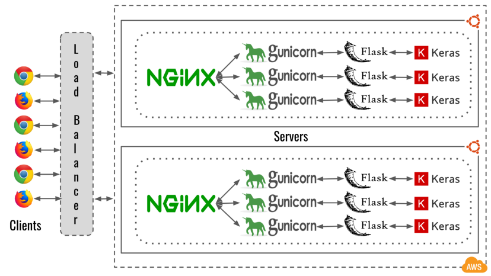

# financial-data-api &middot;  

- [1 - Architecture](#1---architecture)
  - [A - App CICD architecture](#a---app-cicd-architecture)
  - [B - Cloud architecture (AWS)](#b---cloud-architecture-aws)
- [2 - Prerequisites](#2---prerequisites)
- [3 - Quickstart](#3---quickstart)
  - [A - Run local stack](#a---run-local-stack)
  - [B - Deploy the infrastructure on AWS](#b---deploy-the-infrastructure-on-aws)
- [4 - Project file structure](#4---project-file-structure)
- [5 - Gitops](#5---gitops)
  - [A - App CICD workflow](#a---app-cicd-workflow)
  - [B - Infra CICD workflow](#b---infra-cicd-workflow)
  - [C - Running the CICD pipeline locally](#c---running-the-cicd-pipeline-locally)
- [6 - Docker image build pattern](#6---docker-image-build-pattern)
  - [A - SemVer2](#a---semver2)
  - [B - Version bump](#b---version-bump)
- [7 - Testing framework](#7---testing-framework)
  - [A - GIVEN-WHEN-THEN (Martin Fowler)](#a---given-when-then-martin-fowler)
  - [B - Four-Phase Test (Gerard Meszaros)](#b---four-phase-test-gerard-meszaros)
  - [C - Debugging the code with VS Code remote-container extension](#c---debugging-the-code-with-vs-code-remote-container-extension)
- [8 - Gunicorn application server and Nginx reverse proxy](#8---gunicorn-application-server-and-nginx-reverse-proxy)
- [9 - Deployment to AWS with Terraform](#9---deployment-to-aws-with-terraform)
  - [A - Keep your code DRY with Terragrunt](#a---keep-your-code-dry-with-terragrunt)
  - [B - Best practices](#b---best-practices)
- [10 - Improvements](#10---improvements)
- [11 - Useful resources](#11---useful-resources)

This repo is a demo project for dockerized flask applications (REST API). This simplified API exposes GET endpoints that allow you to pull stock prices and trading indicators. What is covered in this repo:

**Application code:**

- Github Actions CICD:
  - Static analysis: flake8, pydocstyle
  - Image misconfiguration/vulnerabilities (Trivy), passing artifacts between jobs
  - Testing patterns with Pytests (unit / integration)
  - Docker image multi-stage build and distribution pattern
- Docker PostgreSQL DB setup for local testing
- Services configuration with Docker Compose
- Makefile template
- Flask blueprints
- Flask-SQLAlchemy implementation
- Nginx (reverse proxy) and Gunicorn (WSGI) implementation
- Dependency injection

**Infrastructure code:**

- Multi AZ serverless architecture:
  - AWS Organizations (multi-account strategy for dev & prod) with SCPs
  - VPC, Security-groups
  - RDS DB, S3, Route53, ALB, API Gateway, AWS Private link
  - IAM configuration (RBAC)
  - AWS Secrets Manager
  - ECS with Fargate (Blue/Green deployment)
- Github Actions CICD:
  - Security scanner (tfsec)
  - Static analysis to enforce best practices (tflint, validate, fmt)
  - Automated infrastructure cost estimation (with Infracost)
- Terragrunt patterns to keep the code DRY across environments
- Automated architecture diagrams from Terraform code
- Terraform remote backend bootstrap

## 1 - Architecture

### A - App CICD architecture


### B - Cloud architecture (AWS)


*(image drawn on [Cloudcraft](https://app.cloudcraft.co/))*
<br></br>

Basic 3-tier application:

- Application layer
- Business logic layer
- Data access layer

## 2 - Prerequisites

- [An AWS Account](https://aws.amazon.com/)
- [Docker](https://docs.docker.com/get-docker/)
- [Docker Compose CLI plugin](https://docs.docker.com/compose/install/compose-plugin/)
- If running on windows: [Docker remote containers on WSL 2](https://docs.microsoft.com/en-us/windows/wsl/tutorials/wsl-containers)
- [AWS CLI](https://docs.aws.amazon.com/cli/latest/userguide/getting-started-install.html)
- [org-formation CLI](https://github.com/org-formation/org-formation-cli#installation)
- [Terraform CLI](https://www.terraform.io/cli/install/apt)
- [Terragrunt](https://terragrunt.gruntwork.io/docs/getting-started/install/)
- [(Optional) Jq](https://stedolan.github.io/jq/download/)

> The API doesn't require python installed on your machine.

## 3 - Quickstart

### A - Run local stack

Run the following commands to:

- Build the Docker images
- Run the Nginx, Localstack, App server and PotsgreSQL DB locally
- Populate the db credentials secret in AWS Secrets Manager (localstack)
- Populate DB with TSLA and AMZN stock prices

```bash
cd app & make build-app build-nginx up
```

Verify the API is running:

```bash
curl -I http://localhost/_healthcheck
```

Get resampled data

```bash
$ curl -G -d 'interval=1' -d 'frequency=Annual' http://localhost/stocks/time-series/AMZN
[
  {
    "close": 92.392,
    "high": 101.79,
    "low": 84.253,
    "open": 95.455,
    "period_start": "2019-01-01",
    "symbol": "AMZN",
    "volume": 8154332000
  },
  {
    "close": 162.8465,
    "high": 177.6125,
    "low": 81.3015,
    "open": 93.75,
    "period_start": "2020-01-01",
    "symbol": "AMZN",
    "volume": 24950814000
  },
  {
    "close": 166.717,
    "high": 188.654,
    "low": 144.05,
    "open": 163.5,
    "period_start": "2021-01-01",
    "symbol": "AMZN",
    "volume": 17076362000
  },
  {
    "close": 116.46,
    "high": 171.4,
    "low": 101.26,
    "open": 167.55,
    "period_start": "2022-01-01",
    "symbol": "AMZN",
    "volume": 10032250600
  }
]
```

### B - Deploy the infrastructure on AWS

A step by step guide to financial-data-api IaC is accessible in [infrastructure/README.md](infrastructure/README.md)

## 4 - Project file structure

The best practice is for infrastructure and application code to sit in different repos, however I wanted to make this demo project self-contained.

```text
.
├── .github
│   ├── workflow
│   │   │── app_code_cicd.yml
│   │   └── infra_code_cicd.yml
├── app
├── docs
├── infrastructure
├── .gitignore
├── Makefile
├── README.md
```

In [./app](./app)

```text
.
├── config
│   ├── dev
│   │   └── config.yaml
│   ├── local
│   │   └── config.yaml
│   ├── prod
│   │   └── config.yaml
│   ├── test
│   │    └── config.yaml
│   └── gunicorn.py
├── docker
│   ├── app
│   │   └── Dockerfile
│   ├── nginx
│   │   ├── Dockerfile
│   │   ├── nginx.ecs.conf
│   │   └── nginx.local.conf
│   └── docker-compose.yaml
├── src
│   ├── __init__.py
│   ├── app.py
│   ├── blueprints
│   │   ├── healthcheck.py
│   │   └── stocks.py
│   ├── helpers.py
│   └── models.py
├── tests
│   ├── __init__.py
│   ├── conftest.py
│   ├── integration
│   │   ├── test_data
│   │   │   └── stocks_ohlcv.csv
│   │   ├── __init__.py
│   │   ├── test_app.py
│   │   └── test_stocks.py
│   └── unit
│       ├── __init__.py
│       └── test_helpers.py
├── .dockerignore
├── .yamllint
├── Makefile
├── requirements.in
├── requirements.txt
```

In [./infrastructure](./infrastructure)

```text
.
├── aws-organizations
│   ├── templates
│   │   ├── dynamodb.yml
│   │   └── s3.yml
│   ├── organization-tasks.yml
│   └── organization.yml
├── terraform
│   ├── live
│   │   ├── _envcommon
│   │   │   └── <resource>.hcl
│   │   ├── <environment>
│   │   │   ├── env.hcl
│   │   │   └── <resource>
│   │   │       ├── main.tf
│   │   │       ├── README.md
│   │   │       └── terragrunt.hcl
│   │   ├── .tflint.hcl
|   │   └── infracost.yml
|   └── modules
├── Makefile
└── README.md
```

`aws-organizations` is the directory that contains the account baseline and `terraform` is used to define workload.

Account baseline contains resources which aren’t directly related to the workload but help with risk reduction, security, compliance and bootstrapping. A baseline may include cross account CloudTrail logging, GuardDuty detectors and similar services. On the other hand a workload is a collection of resources and code that delivers business value, such as a customer-facing application or a backend process.

 `<resource>` can be "vpc" or "security-groups" for instance.

`live` and `modules` folders should sit in 2 separate git repos where `live` contains the currently deployed infratructure whilst `modules` should contain user defined modules. In this repo I only reuse existing terraform modules so `live` and `modules` folders are just placeholders. The idea behind having `live` vs `modules` git repos is to make sure you can point at a versioned module in dev/stage/prod and reduce the risk of impacting prod. Note that for simplicity only `dev` is implemented in this demo

## 5 - Gitops

### A - App CICD workflow


- **yamllint:** Lints yaml files in the repo
- **flake8:** Lints .py files in the repo
- **pydocstyle:** Checks compliance with Python docstring conventions
- **safety:** python packages vulnerabilities scanner
- **image-misconfiguration:** Detect configuration issues in app Dockerfile (Trivy)
- **build:** Build app Docker image and push it to the pipeline artifacts
- **image-vulnerabilities:** App image vulnerablities scanner (Trivy)
- **unit-tests:** Test the smallest piece of code(functions) that can be isolated
- **integration-tests:** Series of tests which call the API
- **push-app-image-to-registry:** Push the application server Docker image to [Docker Hub](https://hub.docker.com/r/tambona29/financial-data-api)
- **push-nginx-image-to-registry:** Push the custom Nginx Docker image to [Docker Hub](https://hub.docker.com/repository/docker/tambona29/nginx-demo)

> Note that the last job should be skipped when running the pipeline locally.
This is ensured using `if: ${{ !env.ACT }}` in the `push-to-registry` jobs.
Running this locally means there will be a conflicting image tag when the Github Actions CICD will try and run it a second time.

### B - Infra CICD workflow


- **format:** Check if all Terraform configuration files are in a canonical format
- **validate:** Verify whether a configuration is syntactically valid and internally consistent
- **tflint:**
  - Find possible errors (like illegal instance types)
  - Warn about deprecated syntax, unused declarations
  - Enforce best practices, naming conventions
- **tfsec:** Static analysis of terraform templates to spot potential security issues
- **infracost:** Infracost shows cloud cost estimates for Terraform

Example of infracost automated PR comment:


One best practice is to always deploy from a single branch to avoid conflicting deployments.

You can automatically generate the terragrunt [README.md](infrastructure/terraform/live/dev/s3/README.md) files using this:

```bash
cd infrastructure && make terraform-docs DIR_PATH=live/dev/s3/README.md
```

### C - Running the CICD pipeline locally

Install [act](https://github.com/nektos/act) to run the jobs on your local machine.

Example:

```bash
make app-cicd  # Run the full app CICD pipeline without pushing to Docker Hub
infra-cicd  # Run the full infrastructure CICD pipeline without applying changes
```

These commands require `secrets.txt` with this content:

```bash
GITHUB_TOKEN=<YOUR_PAT_TOKEN>
DOCKERHUB_USERNAME=<YOUR_DOCKERHUB_USERNAME>
DOCKERHUB_TOKEN=<YOUR_DOCKERHUB_TOKEN>
INFRACOST_API_KEY=<YOUR_INFRACOST_API_KEY>
```

Optionally you could also run pipeline jobs using the [Makefile](./app/Makefile) directly.

Example:

```bash
make pydocstyle
make tests
```

Some jobs such as `image-vulnerabilities` can be run in isolation using the act `-j <job-name>` command (example `-j image-vulnerabilities`).

## 6 - Docker image build pattern

The requirements are:

- A dev image should be pushed to [Docker Hub](https://hub.docker.com/r/tambona29/financial-data-api/tags) everytime a `git push` is made. That allows end-to-end testing in dev environment. I chose Docker Hub over AWS as Docker Hub is still the best choice for distributing software publicly.

- Leverage pipeline artifacts to avoid rebuilding the image from scratch across jobs. Also pass image tag variables between jobs/steps using the output functionality to keep the code DRY.

- The image tag should follow [SemVer specifications](https://semver.org/) which is `MAJOR.MINOR.PATCH-<BRANCH NAME>.dev.<COMMIT SHA>` for dev versions and `MAJOR.MINOR.PATCH` for production use.

### A - SemVer2

|   Branch  | Commit # | Image Version | Image Tag  |
|:---------:|:--------:|:-------------:|:----------:|
| feature-1 |     1    |      1.0.0    | 1.0.0-feature-1.dev.b1d7ba7fa0c6a14041caaaf4025f6cebb924cb0f |
| feature-1 |     2    |      1.0.0    |   1.0.0-feature-1.dev.256e60e615e89332c5f602939463500c1be5d90a |
|   main    |     5     |      1.0.0    |    1.0.0 |

> The [docker/metadata-action@v4](https://github.com/docker/metadata-action#semver) task can automate this but it requires using git tags which can be a bit cumbersome as it requires an update for each commit. So I preferred reimplementing something straightforward that uses the git branch name and commit SHA to form the image tag.

### B - Version bump

Each PR should contain a new version of the `APP_IMAGE_VERSION` and `NGINX_IMAGE_VERSION` in [.github/workflows/app_code_cicd.yml](.github/workflows/app_code_cicd.yml#L6)

## 7 - Testing framework

### A - [GIVEN-WHEN-THEN](https://martinfowler.com/bliki/GivenWhenThen.html) (Martin Fowler)

**GIVEN** - Describes the state of the world before you begin the behavior you're specifying in this scenario. You can think of it as the pre-conditions to the test.

**WHEN** - Behavior that you're specifying.

**THEN** - Changes you expect due to the specified behavior.

### B - [Four-Phase Test](http://xunitpatterns.com/Four%20Phase%20Test.html) (Gerard Meszaros)


*(image from [Four-Phase Test](http://xunitpatterns.com/Four%20Phase%20Test.html))*
<br></br>

For integration testing, the *Setup* phase consists in truncating and repopulating the `market_data` DB (cf [db_fixture](app/tests/conftest.py#L52))

### C - Debugging the code with VS Code remote-container extension

For debugging the code from within a Docker container you can use VS Code with the following config:

in `.devcontainer/devcontainer.json`

```json
{
  "name": "Existing Dockerfile",
  "context": "../app",
  "dockerFile": "../app/docker/app/Dockerfile",

  "runArgs": [ "--network=host"],

  "remoteUser": "root",
  "remoteEnv": {
    "ENVIRONMENT": "test",
    "AWS_ACCESS_KEY_ID": "test",
    "AWS_SECRET_ACCESS_KEY": "test",
    "AWS_DEFAULT_REGION": "us-east-1"
  },
  "customizations": {
    "vscode": {
      "extensions": [
        "ms-python.python"
      ]
    }
  }
}

```

in `.vscode/launch.json`

```text
{
    "version": "0.2.0",
    "configurations": [
        {
            // Testing extensions are very unstable in the remote-container extension
            // Hence it's preferable to run the tests from launch.json
            "name": "test_time_series",
            "type": "python",
            "request": "launch",
            "module": "pytest",
            "args": ["tests/integration/test_stocks.py::test_time_series"],
            "cwd": "${workspaceFolder}/app",
            "justMyCode": false, // Debug only user-written code
        }
    ]
}
```

In addition to this I have also written another [documentation](https://github.com/teddy-ambona/developer-workstation#debugging-inside-a-docker-container) for remote-container extension that can be quite handy.

## 8 - Gunicorn application server and Nginx reverse proxy

From the [Flask documentation](https://flask.palletsprojects.com/en/1.1.x/deploying/):

> "While lightweight and easy to use, Flask’s built-in server is not suitable for production as it doesn’t scale well."

Hence we need a more robust web-server than the flask web server, and the answer is: [Gunicorn](https://gunicorn.org/) and [Nginx](https://www.nginx.com/resources/glossary/nginx/). Gunicorn is a Python WSGI HTTP Server for UNIX. It's a pre-fork worker model. The Gunicorn server is broadly compatible with various web frameworks, simply implemented, light on server resources, and fairly speedy.

With Gunicorn as a web server our app is now more robust and scalable, however we need a way to balance the load to the Gunicorn workers, that's when Nginx is quite useful. Nginx is also a web server but more commonly used as a reverse proxy. **Thereforce Gunicorn acts as an application server whilst Nginx behaves as a reverse proxy**

The terminology is well defined in [this article](https://realpython.com/django-nginx-gunicorn/#replacing-wsgiserver-with-gunicorn):

>- **Flask is a web framework.** It lets you build the core web application that powers the actual content on the site. It handles HTML rendering, authentication, administration, and backend logic.
>
>- **Gunicorn is an application server.** It translates HTTP requests into something Python can understand. Gunicorn implements the Web Server Gateway Interface (WSGI), which is a standard interface between web server software and web applications.
>
>- **Nginx is a web server.** It’s the public handler, more formally called the reverse proxy, for incoming requests and scales to thousands of simultaneous connections.

If you still struggle to understand what Nginx can achieve, check out this [repo from AWS Labs](https://github.com/awslabs/ecs-nginx-reverse-proxy/tree/master/reverse-proxy).

Here’s a diagram illustrating how Nginx fits into a Flask web application:


*(image from [How to Configure NGINX for a Flask Web Application](https://www.patricksoftwareblog.com/how-to-configure-nginx-for-a-flask-web-application/))*
<br></br>

When deployed to AWS our app will look similar to the illustration below, with many servers, each running a Nginx web server and many Gunicorn workers



*(image from [A guide to deploying Machine/Deep Learning model(s) in Productionn](https://medium.com/@maheshkkumar/a-guide-to-deploying-machine-deep-learning-model-s-in-production-e497fd4b734a))*
<br></br>

## 9 - Deployment to AWS with Terraform

IMPORTANT: Following these instructions will deploy code into your AWS account. All of this qualifies for the AWS Free Tier, but if you've already used up your credits, running this code may cost you money. Also this repo is meant to be deployed to your sandbox environment.

[Terraform](https://www.terraform.io/docs) is an infrastructure as code (IaC) tool that allows you to build, change, and version infrastructure safely and efficiently. This includes both low-level components like compute instances, storage, and networking, as well as high-level components like DNS entries and SaaS features. I you are new to Terraform I recommend you read this first [A Comprehensive Guide to Terraform](https://blog.gruntwork.io/a-comprehensive-guide-to-terraform-b3d32832baca#.b6sun4nkn).

Also check [why choosing Terraform over other configuration management and provisioning tools](https://blog.gruntwork.io/why-we-use-terraform-and-not-chef-puppet-ansible-saltstack-or-cloudformation-7989dad2865c). TLDR; Terraform is an open source, cloud-agnostic provisioning tool that supports immutable infrastructure, a declarative language, and a client-only architecture.

### A - Keep your code DRY with Terragrunt

Terragrunt is a thin wrapper for Terraform that provides extra tools for working with multiple Terraform modules. https://www.gruntwork.io

Sample for reference: https://github.com/gruntwork-io/terragrunt-infrastructure-live-example

Teragrunt generated files start with the prefix "terragrunt_" and are ignored in the `.gitignore` file to prevent them from being accidentally commmitted.

### B - Best practices

I strongly recommend going through the [terraform best practices](https://github.com/ozbillwang/terraform-best-practices) before exploring this repo.

This hands-on complies with the [6 pillars for architecture solution](https://aws.amazon.com/architecture/well-architected):

**Operational Excellence** – The ability to run and monitor systems to deliver business value and to continually improve supporting processes and procedures.

**Security** – The ability to protect information, systems, and assets while delivering business value through risk assessments and mitigation strategies.

**Reliability** – The ability of a system to recover from infrastructure or service disruptions, dynamically acquire computing resources to meet demand, and mitigate disruptions such as misconfigurations or transient network issues.

**Performance Efficiency** – The ability to use computing resources efficiently to meet system requirements, and to maintain that efficiency as demand changes and technologies evolve.

**Cost Optimization** – The ability to run systems to deliver business value at the lowest price point.

These pillars aren't trade-off but they should be synergies, for example better sustainability means better performance efficiency and operational excellence means better cost optimization.

A useful tool when it comes to enforcing best practices across your cloud infrastruture is [Amazon Trusted Advisor](https://aws.amazon.com/premiumsupport/technology/trusted-advisor/) which has a free version in the Amazon Web Services Management Console. Only a limited version is available in the free-tier though.

A good architecture design can be facilitated by following these [AWS General design principles](https://wa.aws.amazon.com/wat.design_principles.wa-dp.en.html):

- Stop guessing your capacity needs
- Test systems at production scale
- Automate to make architectural experimentation easier
- Allow for evolutionary architectures
- Drive architectures using data
- Improve through game days

The DevOps checklist:


## 10 - Improvements

Taking a Flask app from development to production is a demanding but rewarding process. There are a couple of areas that I have omitted but would need to be addressed in a real production environment such as:

- Use [AWS Private Links](https://aws.amazon.com/privatelink/) for private connectivity between AWS resources
- User management and authentication for the backend API ([AWS Cognito](https://aws.amazon.com/cognito/))
- Adding monitoring/tracing tools (with Prometheus and Grafana for instance)
- Protection from common web exploits ([Web Application Firewall](https://aws.amazon.com/marketplace/solutions/security/web-application-firewall))
- Network protections for all of your Amazon Virtual Private Clouds (VPCs) from layer 3 to layer 7 ([AWS Network Firewall](https://aws.amazon.com/network-firewall/?whats-new-cards.sort-by=item.additionalFields.postDateTime&whats-new-cards.sort-order=desc))
- VPC interface endpoints to avoid exposing data to the internet ([AWS PrivateLink](https://aws.amazon.com/privatelink/))
- ML powered anomaly detection in VPC flow logs / Cloudtrail logs / DNS logs / EKS audit logs ([Amazon Guard Duty](https://aws.amazon.com/guardduty/))
- [Storage autoscaling for the RDS DB](https://docs.aws.amazon.com/AmazonRDS/latest/UserGuide/USER_PIOPS.StorageTypes.html#USER_PIOPS.Autoscaling)
- Automatically rotate the DB password with AWS Secrets Manager and AWS Lambda
- AWS Control Tower (overkill for this demo, cf [reddit thread](https://www.reddit.com/r/aws/comments/u6kl39/aws_control_tower_yea_or_nay/))

## 11 - Useful resources

- [Amazon Web Services In Plain English](https://expeditedsecurity.com/aws-in-plain-english/)
- [Docker Best Practices for Python Developers](https://testdriven.io/blog/docker-best-practices/)
- [How Amazon ECS manages CPU and memory resources](https://aws.amazon.com/blogs/containers/how-amazon-ecs-manages-cpu-and-memory-resources/)
- [Getting Out of Tricky Terraform Situations](https://spin.atomicobject.com/2021/03/01/terraform-troubleshooting/)
- [Testing IAM policies with the IAM policy simulator](https://docs.aws.amazon.com/IAM/latest/UserGuide/access_policies_testing-policies.html)
- [Mastering AWS Organizations with Infrastructure-As-Code](https://www.youtube.com/watch?v=mLAGHzidHJ0)
