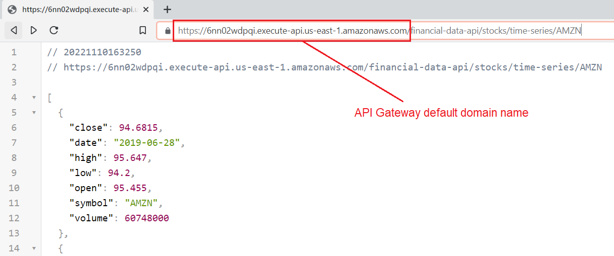

# Infrastructure deployment

- [1 - Environments segmentation](#1---environments-segmentation)
- [2 - Managing AWS Organizations](#2---managing-aws-organizations)
  - [A - Create an AWS Organization](#a---create-an-aws-organization)
  - [B - Generate template that describes all your Organization resources such as Accounts, OUs and SCPs](#b---generate-template-that-describes-all-your-organization-resources-such-as-accounts-ous-and-scps)
  - [C - Switch AWS credentials](#c---switch-aws-credentials)
- [3 - Module dependencies](#3---module-dependencies)
- [4 - Modules deployment](#4---modules-deployment)
  - [A - Create IAM admin group and add admin user to it](#a---create-iam-admin-group-and-add-admin-user-to-it)
  - [B - Create VPC](#b---create-vpc)
    - [Associated costs](#associated-costs)
  - [C - Create security groups (instance-level firewalls)](#c---create-security-groups-instance-level-firewalls)
    - [Associated costs](#associated-costs-1)
  - [D - Create Postgres DB](#d---create-postgres-db)
    - [About AWS Secret Manager](#about-aws-secret-manager)
    - [Associated costs](#associated-costs-2)
  - [E - DNS (Route 53)](#e---dns-route-53)
    - [Associated costs](#associated-costs-3)
  - [F - Create a bastion host](#f---create-a-bastion-host)
    - [Associated costs](#associated-costs-4)
  - [G - RDS PostgreSQL DB: Create DB schema and populate dev data](#g---rds-postgresql-db-create-db-schema-and-populate-dev-data)
  - [H - Create S3 bucket for ALB Logs](#h---create-s3-bucket-for-alb-logs)
  - [I - Application Load Balancer (ALB)](#i---application-load-balancer-alb)
    - [Associated costs](#associated-costs-5)
  - [J - Deploy serverless web-app (ECS with Fargate)](#j---deploy-serverless-web-app-ecs-with-fargate)
    - [Associated costs](#associated-costs-6)
  - [K - Amazon API Gateway](#k---amazon-api-gateway)
    - [Associated costs](#associated-costs-7)
- [5 - Clean up](#5---clean-up)
  - [A - Using cloud-nuke](#a---using-cloud-nuke)
  - [B - Deleting the AWS Account](#b---deleting-the-aws-account)

The best practice is to apply changes through CICD pipeline only. However for bootstraping your terraform backend and setting up your first IAM admin user you will need to apply changes outside a CICD Pipeline.

For minimizing the costs in this demo I personally recommend using `us-east-1` region as [it is the cheapest region](https://www.concurrencylabs.com/blog/choose-your-aws-region-wisely/), that can help keeping the costs down if you are just playing with AWS services.

## 1 - Environments segmentation

In this hands-on we leverage AWS Organization and segment environments(dev/prod) using separate accounts. Also, each module has its own `terraform.state` file stored in s3, this is a best practice set to limit damages in case in errors. Also, the user who is running the terraform code does not need permission for the entire infrastructure but only for the resources he is trying to update.

The below file structure will be created in s3:

```text
├── <env>
│   ├── alb
│   │   └── .tfstate
│   ├── api-gateway
│   │   └── .tfstate
│   ├── data-storage/rds
│   │   └── .tfstate
│   ├── ec2
│   │   └── .tfstate
│   ├── ecs/financial-data-api
│   │   └── .tfstate
│   ├── iam
│   │   └── .tfstate
│   ├── route53
│   │   └── .tfstate
│   ├── s3
│   │   └── .tfstate
│   ├── security_groups
│   │   └── .tfstate
│   └── vpc
│       └── .tfstate
```

## 2 - Managing AWS Organizations

As previously mentionned we want to isolate each environment in a separate AWS account. Some advantages are ([cf article](https://dev.to/oconijn/off-to-a-great-start-with-aws-organizations-1i74)):

- **Limit blast radius:** because mistakes can happen
- **Security Boundary:** simplifies implementing least privilege
- **Data governance:** control access to GDPR governed data
- **Scalability:** every account gets their own resource limits
- **Cost monitoring:** without tagging :smiley:

In this demo we will be splitting the development and production accounts in different organizational units using [AWS Organization Formation](https://github.com/org-formation/org-formation-cli) which is an Infrastructure as Code (IaC) tool for AWS Organizations.

Here is the target setup:


This is a simplified AWS organization for the sake of the demo but in practice you might want to have a compliance account with a S3 bucket where you centralize the CloudTrail logs for all account for instance. You could also have many dev and prod accounts (1 per application or per team).

Note that AWS Organizations is free, you can create many accounts and will be charged only for the AWS resources that you use. Also don't forget to read the AWS article about [Establishing your best practice AWS environment](https://aws.amazon.com/organizations/getting-started/best-practices/#:~:text=While%20you%20may%20begin%20your,grow%20in%20size%20and%20complexity)

### A - Create an AWS Organization

1/ Open the [AWS Organizations console](https://console.aws.amazon.com/organizations/).

2/ Choose Create organization.

You should end up with this:


### B - Generate template that describes all your Organization resources such as Accounts, OUs and SCPs

Run this command to generate the template:

```bash
org-formation init organization.yml  --region us-east-1 [--profile org-master-account]
```

the `organization.yml` file is now generated:


That is your starting point, I've also included an example of [organization.yml](.organization.yml) in this repo.

This example file defines the following OUs, accounts and Service control policies (SCPs):

- Create 1 development OU
- Create 1 production OU
- Create 1 development account
- Create 1 production account
- Enforce using us-east-1 region across OUs
- Deny changing the IAM role used for organization access
- Enforce strong password policy
- Create an S3 bucket <env>-financial-data-api-demo-state in each account (to store the .tfstate files)
- Create a dynamo DB table in each account (to store the state lock of terraform)

As detailed above each account comes with an s3 bucket and dynamo DB for bootstrapping terraform workload.
This avoids running into the chicken and egg issue where terraform backend needs to be stored on the S3 bucket which otherwise should itself be created via terraform. The solution used to imply starting with a local terraform state and migrating the state to S3 after the resource is created, which makes the process quite manual.

You can run the below command to update your AWS Organization and perform tasks:

```bash
cd infrastructure/aws-organizations
org-formation perform-tasks organization-tasks.yml
```

### C - Switch AWS credentials

Now that you have created your dev and prod accounts don't forget to update the access keys in your `~/.aws/credentials` (or `%UserProfile%\.aws\credentials` on Windows). Until you create the admin user in [4.A](#a---create-iam-admin-group-and-add-admin-user-to-it) you can temporarily use the root access keys.

## 3 - Module dependencies

In the `terragrunt.hcl` of each module, we declare the dependencies on other modules so that terragrunt knows in what order to create or destroy the resources when running `terragrunt run-all apply` or `terragrunt run-all destroy`. If any of the modules fail to deploy, then Terragrunt will not attempt to deploy the modules that depend on them(cf [documentation](https://terragrunt.gruntwork.io/docs/features/execute-terraform-commands-on-multiple-modules-at-once/#dependencies-between-modules)).

For example in [terraform/live/\_envcommon/financial-data-api.hcl](./terraform/live/_envcommon/financial-data-api.hcl):

```hcl
dependencies {
  paths = ["../../vpc", "../../security-groups", "../../data-storage", "../../route53"]
}
```

After [installing graphviz](https://installati.one/ubuntu/20.04/graphviz/) you can run:

```bash
cd live/dev
terragrunt graph-dependencies | dot -Tsvg > graph.svg
```


Terragrunt is a great tool for keeping your code DRY but you may be wondering how does that work in practice. Here is the schematic view of how terragrunt will propagate variables through our file structure:

```text
<module>/terragrunt.hcl <-- live/terragrunt.hcl <-- env.hcl

<module>/terragrunt.hcl <-- _envcommon.hcl <-- env.hcl                                                              |
```

Where `<module>/terragrunt.hcl` could be `data-storage/rds
ds/terragrunt.hcl` and `A <-- B` means `A` imports `B`

You can adjust `_envcommon/*` depending on how DRY you want your terraform code to be. I personally tend to only leave the variables declaration as well as the terraform states fetching in these files. The resources are not DRY and remain in the environment folders.

## 4 - Modules deployment

**Important:** You can use root user credentials to start the step A and then you should delete the keys of the root user to comply with the [Security best practices in IAM](https://docs.aws.amazon.com/IAM/latest/UserGuide/best-practices.html).

### A - Create IAM admin group and add admin user to it

Because nobody wants to log in to the AWS web console, go to IAM, and click some buttons in the UI to manage IAM users/groups/roles (unless you are learning and it's the first time you use AWS) we will define IAM resources in this module.

In this section, we assume that the tfstate can be stored in the bucket `dev-financial-data-api-demo-state` under the key `dev/iam/terraform.tfstate`

This module performs the following operations:

- create a user named `demo_admin_user`
- create a login password for `demo_admin_user`
- Enforce MFA for the admin group
- Strenghten the account passwords policy
- Rotate credentials regularly (90 days)
- Create ECS task execution role
- Create app role (to be assumed by the ECS task and the EC2 bastion host)

```bash
cd terraform/live/dev/iam

terragrunt plan
terragrunt apply
```

> Pro tip: You can run apply with the -lock-timeout=<TIME> parameter to tell Terraform to wait up to TIME for a lock to be released (e.g., -lock-timeout=10m will wait for 10 minutes), this is particularly useful if other developers are trying to update the infrastructure at the same time.

Note that Terraform stores the secrets in plain text in the `.tfstate` file, that is why is it not recommended to store `.tfstate` in Github but rather in S3 or other shared storage.

The `demo_admin_user` credentials can be found using the following commands:

```bash
# User password
terragrunt state pull | jq '.resources[] | select(.type == "aws_iam_user_login_profile") | .instances[].attributes.password'

# Access keys
terragrunt state pull | jq '.resources[] | select(.type == "aws_iam_access_key") | .instances[].attributes | with_entries(select(.key|contains("id", "secret")))'
```

You can now delete root access keys via the IAM dashboard(cf below)


Also replace the access keys in your `~/.aws/credentials` (or `%UserProfile%\.aws\credentials` on Windows) with the above `demo_admin_user` keys.

Upon first login as `demo_admin_user` in the web console you will be prompted to change your password, once done you will have access to the web console but all features will either appear empty or will display `API error` until you set up the MFA for the user.

To use the AWS CLI you will need to call the `aws sts get-session-token` [documentation here](https://aws.amazon.com/premiumsupport/knowledge-center/authenticate-mfa-cli/) and store this profile (you need to refresh this profile each time the token expires) in your `~/.aws/credentials`:

in `~/.aws/credentials`:

```text
[default]
aws_access_key_id=<your access key id>
aws_secret_access_key=<your secret access key>

[mfa]
aws_access_key_id=<your access key id>
aws_secret_access_key=<your secret access key>
aws_session_token=<your session token>
```

> Pro tip #1: I personally use the [aws-mfa](https://github.com/broamski/aws-mfa) tool that automates the painful and clunky process of obtaining temporary credentials from the AWS Security Token Service and updating your AWS Credentials.
>
> Pro tip #2: If you have already created a remote state and still see this message `Remote state S3 bucket financial-data-api-demo-state does not exist or you don't have permissions to access it. Would you like Terragrunt to create it? (y/n)` this could be because you need to refresh your sts token.

### B - Create VPC

If you are new to this, a good explanation of what VPCs are is detailed in [AWS VPC Core Concepts in an Analogy and Guide](https://start.jcolemorrison.com/aws-vpc-core-concepts-analogy-guide/).

It's [best practice](https://www.hyperglance.com/blog/aws-vpc-security-best-practices/) to create 1 VPC per application that you want to deploy and ideally 1 account per app, per environment to limit blast radius.

Module path:

- [terraform/live/dev/vpc](terraform/live/dev/vpc)

Resources added:

- Create a new VPC
- Attach an internet gateway to the VPC
- Create a 2 private subnets and 2 public subnets (multi-AZ)
- Create subnet route tables
- Create route table associations

#### Associated costs

Free. However beware of the [traffic cost](https://www.nops.io/aws-data-transfer-cost-operation/).

### C - Create security groups (instance-level firewalls)

Module path:

- [terraform/live/dev/security-groups](terraform/live/dev/security-groups)

Resources added:

- Create a security group for the web-server
- Create a security group for the database
- Create a security group for the bastion host

#### Associated costs

Free

### D - Create Postgres DB

Module path:

- [terraform/live/dev/data-storage/rds](terraform/live/dev/data-storage/rds)

Resources added:

- Create db credentials in AWS Secret Manager
- Create a managed PostgresDB with RDS (multi-AZ in prod only)
- Attach the previously created security-group to the DB
- Associate DB to private subnets in order to avoid inbound/outbound traffic with the internet

#### About AWS Secret Manager

There are a few benefits we get from using AWS Secrets Manager, the sensitive data won't be written as plain text in your application code or in the .tfstate files.

Note that secrets can be injected at task definition in ECS/EKS but whilst passing secrets to your application through the filesystem or environment variables is common, it should be avoided when possible and the Secret Manager API should be used directly (cf [Google best practices](https://cloud.google.com/secret-manager/docs/best-practices#coding_practices))

This comes at the cost that our application is not cloud-agnostic anymore since we have AWS API calls in the application code.

#### Associated costs

- $0.4/secret/month (as of 2022-10-30 cf [AWS Secrets Manager Pricing](https://aws.amazon.com/secrets-manager/pricing/))

This db.t3.micro with 20 GB of General Purpose (SSD) DB storage instance sits into the AWS free-tier so it is free (cf [Amazon RDS Pricing](https://aws.amazon.com/rds/pricing/))

### E - DNS (Route 53)

Module path:

- [terraform/live/dev/route53](terraform/live/dev/route53)

Resources added:

- Private hosted zone
- One record type (A) that matches the alias record of the RDS DB

A private hosted zone is a container that holds information about how you want to route traffic for a domain and its subdomains within one or more VPCs without exposing your resources to the internet (cf [View and update DNS attributes for your VPC](https://docs.aws.amazon.com/vpc/latest/userguide/vpc-dns.html#vpc-dns-updating))

if you still struggle to troubleshoot DNS issues within your VPC: [How can I troubleshoot Route 53 private hosted zone DNS resolution issues?](https://aws.amazon.com/premiumsupport/knowledge-center/route-53-fix-dns-resolution-issues/)

#### Associated costs

- $0.5/month for the hosted zone (as of 2022-10-30)

DNS queries are free when domain or subdomain name the record type (A) in the query match an alias record (cf [Amazon Route 53 pricing](https://aws.amazon.com/route53/pricing/))

Also check out the great explanation on Route53 pricing in [this article](https://www.stormit.cloud/blog/amazon-route-53-pricing/)

### F - Create a bastion host

Module path:

- [terraform/live/dev/ec2](terraform/live/dev/ec2)

Resources added:

- Set of RSA private/public keys
- EC2 instance (with pre-installed tools such as Docker and psql)

Create EC2 instance in public subnet with restrictive security-group that only allows ssh from EC2 Instance connect. As we are using the region us-east-1 the IP range to whitelist is 18.206.107.24/29 cf [https://ip-ranges.amazonaws.com/ip-ranges.json](https://ip-ranges.amazonaws.com/ip-ranges.json). This bastion host is useful for troubleshooting issues from within the VPC (is my DNS private hosted zone working?) or accessing resources that sit in a private subnet (RDS DB for instance).

For more info check out the official documentation: [Set up EC2 Instance Connect](https://docs.aws.amazon.com/AWSEC2/latest/UserGuide/ec2-instance-connect-set-up.html)

> Allow enough time (2-3min) for the instance to launch and run the commands in the `bastion_host_user_data.sh` script. If you try and ssh onto the instance straight after terraform has created it the package installs might not be finished yet.

#### Associated costs

This t2.micro instance sits into the AWS free-tier so it is free. Here is the pricing outside the free-tier:

|   Instance class  | vCPUs | RAM (GiB)| CPU Credits/hr| On-Demand Price/hr |
|:-----------------:|:-----:|:--------:|:-------------:|:------------------:|
|    t2.micro       |   1   |     1    |        6      |        $0.0116     |

*(prices as of 2022-10-30 cf [Amazon EC2 T2 Instances](https://aws.amazon.com/ec2/instance-types/t2/))*

### G - RDS PostgreSQL DB: Create DB schema and populate dev data

We have now instantiated a RDS DB on the private subnet which means connections from/to the internet are not enabled. Even though it would be practical we do not whitelist public IPs as this is bad practice, RDS should remain on a private subnet.

So how do I populate my private RDS DB with a one-off script?

To execute SQL queries on the DB instance we can SSH onto our **bastion host** which is an EC2 instance (in public subnet).

To connect to a private Amazon RDS, it's a best practice to use VPN or AWS Direct Connect ([cf aws documentation](https://aws.amazon.com/premiumsupport/knowledge-center/rds-connect-ec2-bastion-host/#)). Because I intend to remain in AWS free-tier I instead use a bastion host.

Let's use the following command to create the DB schema and populate our DB with the mock dataset

1 - Go to the EC2 web-console


2 - SSH onto the EC2 bastion host using AWS instance connect

3 - Run the following script on the machine

```bash
export AWS_DEFAULT_REGION=us-east-1

# Populate dev DB with test data
docker run --rm \
-e AWS_DEFAULT_REGION=${AWS_DEFAULT_REGION} \
-e ENVIRONMENT=dev \
--entrypoint="" \
tambona29/financial-data-api:1.2.0 python -c \
"from tests.conftest import populate_db_for_local_testing; populate_db_for_local_testing();"

# Fetch DB username and password from AWS Secrets
secrets_json=$(aws secretsmanager get-secret-value --secret-id db/credentials --query SecretString --output text)

export PGUSER=$(echo $secrets_json | jq -r ' .DB_USERNAME')
export PGPASSWORD=$(echo $secrets_json | jq -r ' .DB_PASSWORD')

# Verify the data has been populated
psql -h dev.custom_db_hostname.com -p 5432 -d market_data -c "SELECT * FROM market_data.stocks_ohlcv;"
```

### H - Create S3 bucket for ALB Logs

Module path:

- [terraform/live/dev/s3](terraform/live/dev/s3)

Resources added:

- `<env>-financial-data-api-demo-alb-logs` bucket

### I - Application Load Balancer (ALB)

Module path:

- [terraform/live/dev/alb](terraform/live/dev/alb)

Resources added:

- Application Load Balancer:
  - Listens on port 80
  - Store the access logs in `financial-data-api-demo-alb-logs`
  - Health check the target group at `_healthcheck` endpoint

The role of the ALB will be to balance requests amongst resources in the target group. The ALB is also calling the `_healthcheck` endpoint every 30 seconds and temporarily removes the resource from availability if it is judged not healthy.

You can check that your app is healthy in EC2 > Target groups:


Note that the ALB communicates with the ECS task using the private IP.

> Pro tip: If the ALB keeps draining (restarting containers while preventing breaking open network connections) the ECS service it probably means the security group of the service isn't properly setup

To check the access logs of the ALB you can leverage S3 Select as shown in this picture:


#### Associated costs

This service is within the AWS free-tier with the below limits:

- 750 Hours per month shared between Classic and Application load balancers
- 15 Load Balancer Capacity Units (LCUs) for Application load balancers


*(screenshot from [Elastic Load Balancing pricing](https://aws.amazon.com/elasticloadbalancing/pricing/))*

Prices outside the AWS free-tier:

|   ELB type  | $/ALB-hour | $/LCU-hour|
|:-----------:|:----------:|:---------:|
|     ALB     |   0.0225   |   0.008   |

*(prices as of 2022-11-02)*

### J - Deploy serverless web-app (ECS with Fargate)

Module path:

- [terraform/live/dev/ecs/financial-data-api](terraform/live/dev/ecs/financial-data-api)

Resources added:

- Log group "/aws/ecs/aws-fargate"
- ECS Cluster
- ECS Service
- ECS Task definition
- Assign web-server security-group and role to ECS task

Elastic Container Services allows you to deploy containerized tasks on a cluster. In this demo I chose AWS Fargate [capacity provider](https://docs.aws.amazon.com/AmazonECS/latest/developerguide/cluster-capacity-providers.html) for a serverless infrastructure . ECS concepts are well explained in the [Amazon ECS clusters documentation](https://docs.aws.amazon.com/AmazonECS/latest/developerguide/clusters.html).

ECS does not run or execute your container (AWS Fargate will) but only provides the control plane to manage tasks. Below is the general architecture of our API in ECS with AWS Fargate.


*(image drawn from [draw.io](https://www.draw.io/?splash=0&libs=aws4))*

Two IAM roles are needed here, the previously created `ecs_task_execution_role` is assigned to the service so that ECS can pull the image from Dockerhub and send the logs to Cloudwatch and the `app_role` is attached to the task itself. The service will build or kill tasks to meet the `desired_count` requirement (only 1 in this demo). Blue/Green deployment is the default behaviour for the ECS service provided you have more than one task set in `desired_count`, otherwise you can expect some downtime.

Note that in the task definition we use the `awsvpc` network mode (cf [best practices](https://docs.aws.amazon.com/AmazonECS/latest/bestpracticesguide/application.html)) and maps the container port 5000 (gunicorn server) with the host however we only want to expose the Nginx server that runs on port 80. That's when the security-group at service level becomes useful as it is only allowing incoming traffic from port 80.

We can verify that our 2 containers are up and running in the ECS web-console as shown be below.


#### Associated costs

Unfortunately ECS is not part of the AWS free tier. For ECS with Fargate launch type you will be charged based on vCPU and memory resources that the containerized application requests. See below:

|   Launch type  | $/vCPU/h |    $/GB/h   |
|:--------------:|:--------:|:-----------:|
|    FARGATE     |  0.04048 |  0.004445   |
|  FARGATE SPOT  |  0.012144|  0.0013335  |

*(prices as of 2022-10-30 cf [AWS Fargate Pricing](https://aws.amazon.com/fargate/pricing/))*

### K - Amazon API Gateway

Module path:

- [terraform/live/dev/api-gateway](terraform/live/dev/api-gateway)

Resources added:

- API Gateway
  - Route "financial-data-api/{proxy+}"
  - ALB integration with VPC Link
- Cloudwatch group `/aws/debug_apigateway`

Amazon API Gateway has many features including authentication where Amazon API Gateway can leverage IAM and AWS Cognito (not implementd in this demo) for user management.

API Gateway uses path-based routing to map a path to a back-end service. In this demo we access our back-end service with a request of the form `<api gateway uri>/<route>/<proxy>` where the route is "financial-data-api", this route is not forwarded to the backend service, only the proxy part of the URL is forwarded thanks to the path mapping declared in the integration.

AWS PrivateLink is a technology that provides private connectivity between VPCs and services. This allows the Amazon API Gateway to communicate with our ALB without going through the internet.

As explained in [Introducing Amazon API Gateway Private Endpoints](https://aws.amazon.com/blogs/compute/introducing-amazon-api-gateway-private-endpoints/)

> "Here’s how this works.
>
> API Gateway private endpoints are made possible via AWS PrivateLink interface VPC endpoints. Interface endpoints work by creating elastic network interfaces in subnets that you define inside your VPC. Those network interfaces then provide access to services running in other VPCs, or to AWS services such as API Gateway. When configuring your interface endpoints, you specify which service traffic should go through them."

We can now access our API from the web browser:

in API Gateway > Details:




I did not bother buying a public domain name for this demo but in practice we would want a HTTPS endpoint with a more readable name like "mysuperapi.com".

#### Associated costs

|   Pricing per VPC endpoint per AZ ($/hour)  | Pricing per GB of Data Processed ($)* |
|:-------------------------------------------:|:-------------------------------------:|
|              0.01 (ie $80/year)             |                 0.01                  |

**First 1 PB, check out [AWS PrivateLink pricing](https://aws.amazon.com/privatelink/pricing/) for more info*

The [API Gateway free tier](https://aws.amazon.com/api-gateway/pricing/) includes one million HTTP API calls, one million REST API calls, one million messages, and 750,000 connection minutes per month for up to 12 months.

## 5 - Clean up

There are 2 ways of removing every resources created in this demo:

### A - Using cloud-nuke

Note that if anything goes wrong and you want to start from all over again you can install [cloud-nuke](https://github.com/gruntwork-io/cloud-nuke) and run this very destructive command:

```bash
# This will destroy all resources in the specified regions
cloud-nuke aws --region=us-east-1 --region=global

# cloud-nuke does not support IAM policies yet so you might also have to remove policies in the web-console
# Github issue: https://github.com/gruntwork-io/cloud-nuke/issues/116#issuecomment-928002457
```

### B - Deleting the AWS Account

The best way to ensure you won't be billed for some services that you have forgotten is to delete the AWS account.
AWS does not provide an API for deleting accounts (probably for good reasons) so you will have to do it in the console.
