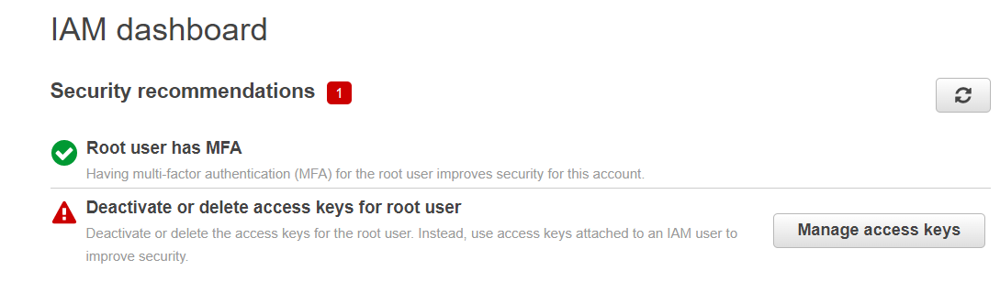
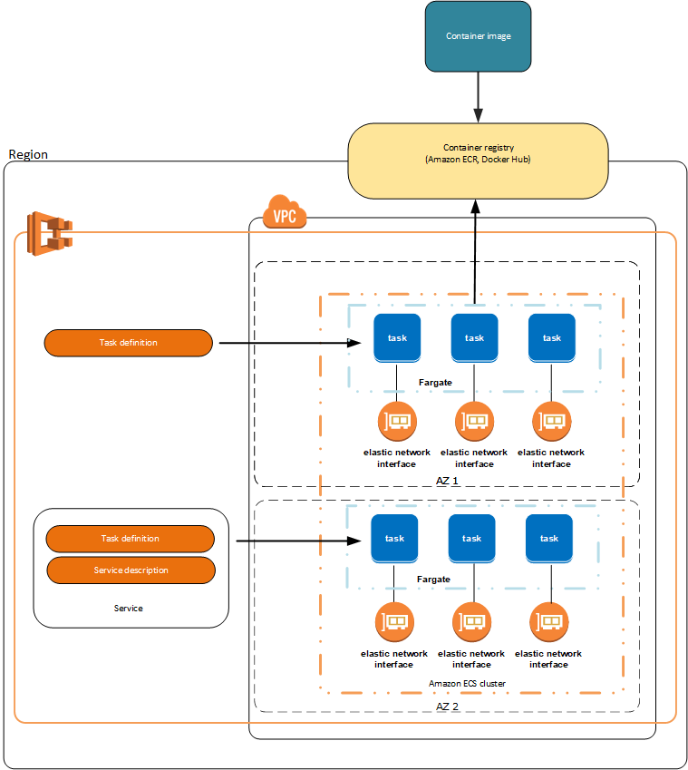

# Terraform deployment

- [1 - Environments segmentation](#1---environments-segmentation)
- [1 - [Optional] If you have a new AWS account](#1---optional-if-you-have-a-new-aws-account)
- [2 - Module dependencies](#2---module-dependencies)
- [3 - Modules deployment](#3---modules-deployment)
  - [A - Create S3 bucket and Dynamo DB for state lock](#a---create-s3-bucket-and-dynamo-db-for-state-lock)
  - [B - Create IAM admin group and add admin user to it](#b---create-iam-admin-group-and-add-admin-user-to-it)
  - [C - Create VPC](#c---create-vpc)
  - [D - Create security groups (firewalls at instance level)](#d---create-security-groups-firewalls-at-instance-level)
  - [E - Create Postgres DB](#e---create-postgres-db)
    - [About AWS Secret Manager](#about-aws-secret-manager)
  - [F - RDS PostgreSQL DB: Create DB schema and populate dev data](#f---rds-postgresql-db-create-db-schema-and-populate-dev-data)
  - [G - Deploy serverless web-app](#g---deploy-serverless-web-app)
    - [AWS App runner](#aws-app-runner)

The best practice is to apply changes through CICD pipeline only. However for bootstraping your terraform backend and setting up your first IAM admin user you will need to apply changes outside a CICD Pipeline, this is what is shown in 1, 3.A & 3.B.

## 1 - Environments segmentation

In this hands-on we leverage AWS Organization and segment environments(dev/stage/prod) using separate accounts. Each module has its own `terraform.state` file stored in s3, this is a best practice set to limit damages in case in errors. Also, the user who is running the terraform code does not need permission for the entire infrastructure but only for the resources he is trying to update.

For each environment the below file structure will be created in s3:

```text
├── global
│   ├── iam
│   │   └── .tfstate
│   ├── s3
│   │   └── .tfstate
├── <env>
│   ├── data-storage
│   │   └── .tfstate
│   ├── security_groups
│   │   └── .tfstate
│   ├── services
│   │   └── .tfstate
│   └── vpc
│       └── .tfstate
```

## 1 - [Optional] If you have a new AWS account

If you already have your remote backend setup you can skip this part and jump to [3 - Create IAM user, role and policies](#2---create-iam-admin-group-and-add-admin-user-to-it)

The first step will be to create a s3 bucket to store the remote backend and to create a Dynamo DB for storing the lock.

Note that if anything goes wrong and you want to start from all over again you can install [cloud-nuke](https://github.com/gruntwork-io/cloud-nuke) and run this very destructive command:

```bash
# This will destroy all resources in the specified regions
cloud-nuke aws --region=us-east-1 --region=global

# cloud-nuke does not support IAM policies yet so you might also have to remove policies in the web-console
# Github issue: https://github.com/gruntwork-io/cloud-nuke/issues/116#issuecomment-928002457
```

Configure your AWS credentials as environment variables.

> Important: You can use root user credentials for the steps 2 and 3 then you should delete the keys of the root user to comply with the [Security best practices in IAM](https://docs.aws.amazon.com/IAM/latest/UserGuide/best-practices.html).

In `~/.aws/credentials` (or `%UserProfile%\.aws\credentials` on Windows):

```bash
[default]
aws_access_key_id=<your access key id>
aws_secret_access_key=<your secret access key>
```

I personally recommend using `us-east-1` region as [it is the cheapest region](https://www.concurrencylabs.com/blog/choose-your-aws-region-wisely/), that can help keeping the costs down if you are just playing with AWS services.

## 2 - Module dependencies

In the `terragrunt.hcl` of each module, we declare the dependencies on other modules so that terragrunt knows in what order to create or destroy the resources when running `terragrunt run-all apply` or `terragrunt run-all destroy`. If any of the modules fail to deploy, then Terragrunt will not attempt to deploy the modules that depend on them(cf [documentation](https://terragrunt.gruntwork.io/docs/features/execute-terraform-commands-on-multiple-modules-at-once/#dependencies-between-modules)).

```hcl
dependencies {
  paths = ["../vpc", "../security_groups", "../postgres"]
}
```

After [installing graphviz](https://installati.one/ubuntu/20.04/graphviz/) you can run:

```bash
terragrunt graph-dependencies | dot -Tsvg > graph.svg
```


## 3 - Modules deployment

### A - Create S3 bucket and Dynamo DB for state lock

Run the below commands to:

- create a financial-data-api-demo-state S3 bucket
- create a Dynamo DB

Update your region in terraform/live/global/s3/terragrunt.hcl, by default it is `us-east-1`. For simplicity we use a single region in this tutorial

```hcl
locals {
  aws_region = "us-east-1"
}
```

```bash
cd terraform/live/global/s3

# We can omit "terragrunt init" here as terragrunt has an Auto-Init feature.

terragrunt plan
terragrunt apply
```

Now we will setup remote terraform backend by appending this to the end of `terraform/live/global/s3/terragrunt.hcl`:

```hcl
remote_state {
  backend = "s3"
  generate = {
    path      = "terragrunt_backend.tf"
    if_exists = "overwrite_terragrunt"
  }
  config = {
    bucket         = "financial-data-api-demo-state"
    key            = "global/s3/terraform.tfstate"
    region         = local.env_vars.locals.aws_region
    dynamodb_table = "financial-data-api-demo-locks"
    encrypt        = true
  }
}
```

You can now run

```bash
$ terragrunt init

WARN[0001] The remote state S3 bucket financial-data-api-demo-state needs to be updated: 
WARN[0001]   - Bucket Root Access
WARN[0001]   - Bucket Enforced TLS
Remote state S3 bucket financial-data-api-demo-state is out of date. Would you like Terragrunt to update it? (y/n)
```

Type "y", now you should see:

```bash
Initializing the backend...
Acquiring state lock. This may take a few moments...
Do you want to copy existing state to the new backend?
  Pre-existing state was found while migrating the previous "local" backend to the
  newly configured "s3" backend. No existing state was found in the newly
  configured "s3" backend. Do you want to copy this state to the new "s3"
  backend? Enter "yes" to copy and "no" to start with an empty state.

  Enter a value:
```

Type "yes"

You should now see

```bash
Releasing state lock. This may take a few moments...

Successfully configured the backend "s3"! Terraform will automatically
use this backend unless the backend configuration changes.
```

> Pro tip: You can run apply with the -lock-timeout=<TIME> parameter to tell Terraform to wait up to TIME for a lock to be released (e.g., -lock-timeout=10m will wait for 10 minutes), this is particularly useful if other developers are trying to update the infrastructure at the same time.

### B - Create IAM admin group and add admin user to it

Because nobody wants to log in to the AWS web console, go to IAM, and click some buttons in the UI to manage IAM users/groups/roles (unless you are learning and it's the first time you use AWS) we will define IAM resources in this module.

In this section, we assume that the tfstate can be stored in the bucket `financial-data-api-demo-state` under the key `global/iam/terraform.tfstate`

This module performs the following operations:

- create a user named `demo_admin_user`
- create a login password for `demo_admin_user`
- Enforce MFA for the admin group
- Strenghten the account passwords policy
- Rotate credentials regularly (90 days)
- Create ECS task execution role
- Create ECS task role

```bash
cd terraform/live/global/iam

terragrunt plan
terragrunt apply
```

Note that Terraform stores the secrets in plain text in the `.tfstate` file, that is why is it not recommended to store `.tfstate` in Github but rather in S3 or other shared storage.

The `demo_admin_user` credentials can be found using the following commands:

```bash
# User password
terragrunt state pull | jq '.resources[] | select(.type == "aws_iam_user_login_profile") | .instances[].attributes.password'

# Access keys
terragrunt state pull | jq '.resources[] | select(.type == "aws_iam_access_key") | .instances[].attributes | with_entries(select(.key|contains("id", "secret")))'
```

You can now delete root access keys via the IAM dashboard(cf below)



Also replace the access keys in your `~/.aws/credentials` (or `%UserProfile%\.aws\credentials` on Windows) with the above `demo_admin_user` keys.

Upon first login as `demo_admin_user` in the web console you will be prompted to change your password, once done you will have access to the web console but all features will either appear empty or will display `API error` until you set up the MFA for the user.

To use the AWS CLI you will need to call the `aws sts get-session-token` [documentation here](https://aws.amazon.com/premiumsupport/knowledge-center/authenticate-mfa-cli/) and store this profile (you need to refresh this profile each time the token expires) in your `~/.aws/credentials`:

in `~/.aws/credentials`:

```text
[default]
aws_access_key_id=<your access key id>
aws_secret_access_key=<your secret access key>

[mfa]
aws_access_key_id=<your access key id>
aws_secret_access_key=<your secret access key>
aws_session_token=<your session token>
```

> Pro tip: I personally use the [aws-mfa](https://github.com/broamski/aws-mfa) tool that automates the painful and clunky process of obtaining temporary credentials from the AWS Security Token Service and updating your AWS Credentials.

### C - Create VPC

If you are new to this, a goood explanation of what VPCs are is detailed in [AWS VPC Core Concepts in an Analogy and Guide](https://start.jcolemorrison.com/aws-vpc-core-concepts-analogy-guide/).

It's [best practice](https://www.hyperglance.com/blog/aws-vpc-security-best-practices/) to create 1 VPC per application that you want to deploy and ideally 1 account per app, per environment to limit blast radius.

module paths:

- [live/dev/vpc](live/dev/vpc)
- [live/prod/vpc](live/prod/vpc)

Resources added:

- Create a new VPC
- Attach an internet gateway to the VPC
- Create a 2 private subnets and 2 public subnets (multi-AZ)
- Create subnet route tables
- Create route table associations

### D - Create security groups (instance-level firewalls)

module paths:

- [live/dev/security-groups](live/dev/security-groups)
- [live/prod/security-groups](live/prod/security-groups)

Resources added:

- Create a security group for the web-server
- Create a security group for the database

### E - Create Postgres DB

module paths:

- [live/dev/data-storage](live/dev/data-storage)
- [live/prod/data-storage](live/prod/data-storage)

Resources added:

- Create db credentials in AWS Secret Manager
- Create a managed PostgresDB with RDS (multi-AZ in prod only)
- Attach the previously created security-group to the DB
- Associate DB to private subnets in order to avoid inbound/outbound traffic with the internet

#### About AWS Secret Manager

There are a few benefits we get from using AWS Secrets Manager, the sensitive data won't be written as plain text in your application code or in the .tfstate files.

Note that secrets can be injected at task definition in ECS/EKS but whilst passing secrets to your application through the filesystem or environment variables is common, it should be avoided when possible and the Secret Manager API should be used directly (cf [Google best practices](https://cloud.google.com/secret-manager/docs/best-practices#coding_practices))

This comes at the cost that our application is not cloud-agnostic anymore since we have AWS API calls in the application code. Also at the time of this writing AWS App Runner doesn't support secrets injection ([cf open issue](https://github.com/aws/apprunner-roadmap/issues/6))

### F - RDS PostgreSQL DB: Create DB schema and populate dev data

We have now instantiated a RDS DB on the private subnet which means connections from/to the internet are not enabled. Even though it would be practical we do not whitelist public IPs as this is bad practice, RDS should remain on a private subnet.

So how do I populate my private RDS DB with a one-off script?

To execute SQL queries on the DB instance we can SSH onto an EC2 instance (in public subnet) that we call **bastion host**.

Let's use the following command to create the DB schema and populate our DB with the mock dataset

To connect to a private Amazon RDS, it's a best practice to use VPN or AWS Direct Connect ([cf aws documentation](https://aws.amazon.com/premiumsupport/knowledge-center/rds-connect-ec2-bastion-host/#)). Because I intend to remain in AWS free-tier I instead use a bastion host.

1 - Create EC2 instance (bastion host) on public subnet with restrictive sg (should only allow ssh from public CIDR of your corporation)

2 - SSH onto the EC2 bastion host using AWS instance connect (in the web console)

3 - Run the following script on the machine (make sure you replace the DB host name as well as the password)

```bash
# Update installed packages to the latest available releases.
sudo yum -y update

# "Git clone" the repo that contains test data.
sudo yum -y install git
git clone https://github.com/teddy-ambona/financial-data-api.git

# Replace dev config placeholders with actual dev config.
cd financial-data-api
cp -r config/api_settings ./settings
cat << EOT > settings/dev/config.yaml
---
APP:
  DEBUG: true
  PORT: 80

DB:
  DB_NAME: market_data
  DB_USERNAME: postgres
  DB_PORT: 5432
  DB_HOST: <YOUR_DB_HOST_NAME>
EOT

# Install Docker.
sudo yum -y install docker
sudo service docker start  # Start Docker daemon.
sudo usermod -a -G docker ec2-user  # Avoid using "sudo" for each command.

# Populate dev DB with test data
docker run --rm -e ENVIRONMENT=development \
-e DB_PASSWORD=<REPLACE_WITH_YOUR_DB_PASSOWRD> \
--entrypoint="" \
-v ${PWD}:/app -w="/app" \
tambona29/financial-data-api:0.4.0 python -c \
"from tests.conftest import populate_db_for_local_testing; populate_db_for_local_testing();"

# Install psql
sudo tee /etc/yum.repos.d/pgdg.repo<<EOF
[pgdg12]
name=PostgreSQL 12 for RHEL/CentOS 7 - x86_64
baseurl=https://download.postgresql.org/pub/repos/yum/12/redhat/rhel-7-x86_64
enabled=1
gpgcheck=0
EOF

sudo yum -y makecache
sudo yum -y install postgresql12 postgresql12-server

# Verify the data has been populated
psql -h <YOUR_DB_HOST_NAME> -p 5432 -d market_data -U postgres -c "SELECT * FROM market_data.stocks_ohlcv;"
```

### G - Deploy serverless web-app

#### ECS with Fargate ASG

Elastic Container Services allows you to deploy containerized tasks on a cluster. In this demo I chose AWS Fargate [capacity provider](https://docs.aws.amazon.com/AmazonECS/latest/developerguide/cluster-capacity-providers.html) for a serverless infrastructure . ECS concepts are well explained in the [Amazon ECS clusters documentation](https://docs.aws.amazon.com/AmazonECS/latest/developerguide/clusters.html).

ECS does not run or execute your container (AWS Fargate will) but only provides the control plane to manage tasks. Below is the general architecture of ECS with AWS Fargate.



*(image from [Amazon ECS launch types](https://docs.aws.amazon.com/AmazonECS/latest/developerguide/launch_types.html))*
<br></br>

module paths:

- [live/dev/services/financial-data-api](live/dev/services/financial-data-api)
- [live/prod/services/financial-data-api](live/prod/services/financial-data-api)

Resources added:

- Log group "/aws/ecs/aws-fargate"
- ECS Cluster
- ECS Service
- ECS Task definition
- Assign web-server security-group and role to ECS task
