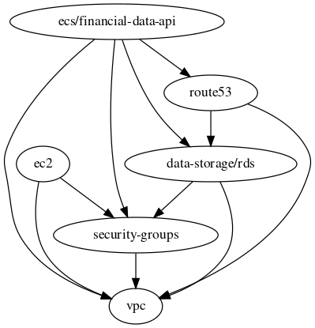

# Terraform deployment

- [A - [Optional] If you have a new AWS account](#a---optional-if-you-have-a-new-aws-account)
- [B - Module dependencies](#b---module-dependencies)
- [C - Modules deployment](#c---modules-deployment)
  - [1 - Create S3 bucket and Dynamo DB for state lock](#1---create-s3-bucket-and-dynamo-db-for-state-lock)
  - [2 - Create IAM admin group and add admin user to it](#2---create-iam-admin-group-and-add-admin-user-to-it)
  - [3 - Create VPC](#3---create-vpc)
  - [4 - Create security groups (firewalls)](#4---create-security-groups-firewalls)
  - [5 - Create Postgres DB](#5---create-postgres-db)
  - [6 - Create DB schema and populate data](#6---create-db-schema-and-populate-data)
  - [7 - Deploy serverless web-app with ECS and Fargate](#7---deploy-serverless-web-app-with-ecs-and-fargate)

We segment environments(dev/stage/prod) using separated directories. Each directory has its own `terraform.state` file stored in s3, this is a best practice set to limit damages in case in errors. Also, the user who is running the terraform code does not need permission for the entire infrastructure but only for the resources he is trying to update.

## A - [Optional] If you have a new AWS account

If you already have your remote backend setup you can skip this part and jump to [3 - Create IAM user, role and policies](#2---create-iam-admin-group-and-add-admin-user-to-it)

The first step will be to create a s3 bucket to store the remote backend and to create a Dynamo DB for storing the lock.

Note that if anything goes wrong and you want to start from all over again you can install [cloud-nuke](https://github.com/gruntwork-io/cloud-nuke) and run this very destructive command:

```bash
# This will destroy all resources in the specified regions
cloud-nuke aws --region=us-east-1 --region=global

# cloud-nuke does not support IAM policies yet so you might also have to remove policies in the web-console
# Github issue: https://github.com/gruntwork-io/cloud-nuke/issues/116#issuecomment-928002457
```

Configure your AWS credentials as environment variables.

> Important: You can use root user credentials for the steps 2 and 3 then you should delete the keys of the root user to comply with the [Security best practices in IAM](https://docs.aws.amazon.com/IAM/latest/UserGuide/best-practices.html).

In `~/.aws/credentials` (or `%UserProfile%\.aws\credentials` on Windows):

```bash
[default]
aws_access_key_id=<your access key id>
aws_secret_access_key=<your secret access key>
```

## B - Module dependencies

In the `terragrunt.hcl` of each module, we declare the dependencies on other modules so that terragrunt knows in what order to create or destroy the resources when running `terragrunt run-all apply` or `terragrunt run-all destroy`. If any of the modules fail to deploy, then Terragrunt will not attempt to deploy the modules that depend on them(cf [documentation](https://terragrunt.gruntwork.io/docs/features/execute-terraform-commands-on-multiple-modules-at-once/#dependencies-between-modules)).

```hcl
dependencies {
  paths = ["../vpc", "../security_groups", "../postgres"]
}
```

After [installing graphviz](https://installati.one/ubuntu/20.04/graphviz/) you can run:

```bash
terragrunt graph-dependencies | dot -Tsvg > graph.svg
```



## C - Modules deployment

### 1 - Create S3 bucket and Dynamo DB for state lock

Run the below commands to:

- create a financial-data-api-demo-state S3 bucket
- create a Dynamo DB

Update your region in terraform/live/global/s3/terragrunt.hcl, by default it is `us-east-1`

```hcl
locals {
  aws_region = "us-east-1"
}
```

```bash
cd terraform/live/global/s3

# We can omit "terragrunt init" here as terragrunt has an Auto-Init feature.

terragrunt plan
terragrunt apply
```

Now we will setup remote terraform backend by appending this to the end of `terraform/live/global/s3/terragrunt.hcl`:

```hcl
remote_state {
  backend = "s3"
  generate = {
    path      = "terragrunt_backend.tf"
    if_exists = "overwrite_terragrunt"
  }
  config = {
    bucket         = "financial-data-api-demo-state"
    key            = "global/s3/terraform.tfstate"
    region         = local.env_vars.locals.aws_region
    dynamodb_table = "financial-data-api-demo-locks"
    encrypt        = true
  }
}
```

You can now run

```bash
$ terragrunt init

WARN[0001] The remote state S3 bucket financial-data-api-demo-state needs to be updated: 
WARN[0001]   - Bucket Root Access
WARN[0001]   - Bucket Enforced TLS
Remote state S3 bucket financial-data-api-demo-state is out of date. Would you like Terragrunt to update it? (y/n)
```

Type "y", now you should see:

```bash
Initializing the backend...
Acquiring state lock. This may take a few moments...
Do you want to copy existing state to the new backend?
  Pre-existing state was found while migrating the previous "local" backend to the
  newly configured "s3" backend. No existing state was found in the newly
  configured "s3" backend. Do you want to copy this state to the new "s3"
  backend? Enter "yes" to copy and "no" to start with an empty state.

  Enter a value:
```

Type "yes"

You should now see

```bash
Releasing state lock. This may take a few moments...

Successfully configured the backend "s3"! Terraform will automatically
use this backend unless the backend configuration changes.
```

### 2 - Create IAM admin group and add admin user to it

In this section, we assume that the tfstate can be stored in the bucket `financial-data-api-demo-state` under the key `global/iam/terraform.tfstate`

This module performs the following operations:

- create a user named `demo_admin_user`
- create a login password for `demo_admin_user`
- Enforce MFA for the admin group
- Strenghten the account passwords policy

```bash
cd terraform/live/global/iam

terragrunt plan
terragrunt apply
```

The `demo_admin_user` credentials can be found using the following commands:

```bash
# User password
terragrunt state pull | jq '.resources[] | select(.type == "aws_iam_user_login_profile") | .instances[].attributes.password'

# Access keys
terragrunt state pull | jq '.resources[] | select(.type == "aws_iam_access_key") | .instances[].attributes | with_entries(select(.key|contains("id", "secret")))'
```

You can now delete root access keys and replace the access keys in your `~/.aws/credentials` (or `%UserProfile%\.aws\credentials` on Windows) with the above `demo_admin_user` keys.

Upon first login in the web console you will be prompted to change your password, once done you will have access to the web console but all features will either appear empty or will display `API error` until you set up the MFA for the user.

Note that Terraform stores the secrets in plain text in the `.tfstate` file, that is why is it not recommended to store `.tfstate` in Github but rather in S3 or other shared storage.

### 3 - Create VPC

[cf terraform-aws-modules/vpc/aws](https://github.com/terraform-aws-modules/terraform-aws-vpc):

This module will:

- Create a new VPC
- Attach an internet gateway to the VPC
- Create a private subnet and a public subnet
- Create a NAT gateway
- Create a route table association

```bash
cd terraform/live/dev/vpc

terragrunt plan
terragrunt apply
```

### 4 - Create security groups (firewalls)

[cf terraform-aws-security-group](https://github.com/terraform-aws-modules/terraform-aws-security-group)

This module will:

- Create a security group for the web-server
- Create a security group for the database

```bash
cd terraform/live/dev/security-groups

terragrunt plan
terragrunt apply
```

### 5 - Create Postgres DB

[cf terraform-aws-modules/rds/aws](https://registry.terraform.io/modules/terraform-aws-modules/rds/aws/latest)

This module will:

- Create a managed PostgresDB with RDS
- Attach the previously created security-group to the DB
- Associate DB to private subnets in order to avoid connection from the internet

```bash
cd terraform/live/dev/data-storage

terragrunt plan
terragrunt apply
```

### 6 - Create DB schema and populate data

Let's use the following command to create a schema and populate our DB with the mock dataset

Using our AWS "admin" user keys

```bash
```

### 7 - Deploy serverless web-app with ECS and Fargate
